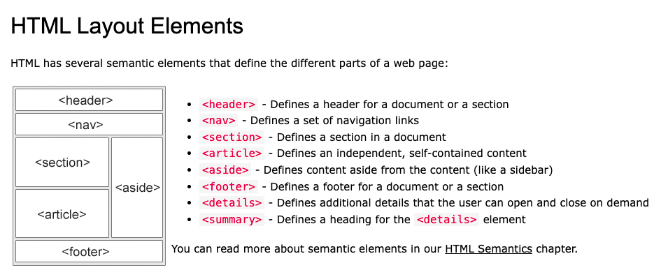

# Homework1-Jessie Doherty

For my first homework, I've done the following steps:

# 1. Evaluation of the original HTML and CSS files.

- Check the <link> and <a> tags to see whether everything works. I found the link of "search-engine-optimization" is not working properly.
- Check the tags. I've found that the original html was marked with mainly 
 tags, not semantic tags.

# 2. Making changes based on my evaluation in both HTML and CSS.

In HTML, I've made the following changes:

- changing the <title> content into "Horiseon Website", though this part won't show on the page, it makes the computer know more about what this file is about.
- changing the 
 tags in the the header part into <header> tag. Changing the <ul> tags into <menu> tag. Changing the <li> tags into <button> tag. The reason for the change is: this is a header, so <header> tag is more appropriate. <ul> and <li> can make an unordered list, but they're listed with bullet points, not like the <menu> and <button> combination that can present all 3 buttons horizontally. I've also made changes to the CSS in this part to match the selectors and sytles.
- According to the w3schools, the typical layout of a webpage is:
  
  So I made the left part with 3 sections, by using <section> tags. In the first <section>, I need to add an "id" for "search-engine-optimization" so it links with the header button.
- According to the layout I've shown above, I've made the right part into a side bar by using <aside> tag.
- According to the layout picture, I've changed the last 
 into <footer> since this part serves as a footer of the page.

# 3. Review all changes I've made to make sure it meets the criteria.

# 4. Adding comments in HTML for reviewers.

- I've added some comments in the HTML to clarify my changes.

# 4. Write the README.md, to summarize what I've done.

# 5. How I did my research.

- I did my research on w3schools, MDN web docs to understand the functionalities of tags.
- I also found that by using "inspect" feature on a webpage can help me get what I want quicker.
